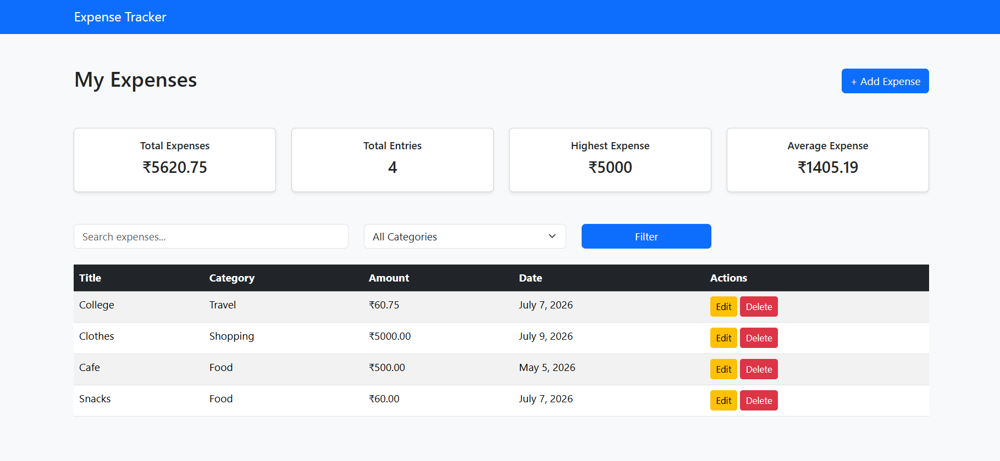
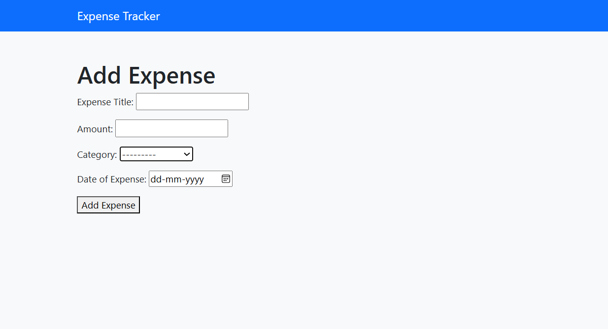

# Expense Tracker

A responsive expense tracking web application built with **Django** that helps users manage their daily expenses efficiently. The application supports full **CRUD operations**, expense analytics through a dashboard, searching, filtering, and a clean Bootstrap-based user interface.

---

## Preview

### Dashboard



### Add Expense



---

## Features

- View expenses
- Add expenses
- Delete expenses
- Update expenses
- Dashboard with:
    - Total Expenses
    - Total Entries
    - Highest Expense
    - Average Expense
- Search expenses by title
- Filter expenses by category
- Responsive Bootstrap UI
- Django Admin Panel

## Tech Stack

- Python
- Django
- HTML5
- CSS3 
- Bootstrap 5
- SQLite (Development Database)
- Git and GitHub

## Getting Started

### Clone the repository

```bash
git clone https://github.com/ruestar19/expense-tracker-django.git
```

### Navigate to the project

```bash
cd expense-tracker-django
```

### Create a virtual environment

```bash
python -m venv venv
```

### Activate the virtual environment

**Windows**

```bash
venv\Scripts\activate
```

**macOS/Linux**

```bash
source venv/bin/activate
```

### Install dependencies

```bash
pip install -r requirements.txt
```

### Apply migrations

```bash
python manage.py migrate
```

### Run the development server

```bash
python manage.py runserver
```

Visit:

```
http://127.0.0.1:8000/
```

---

## What I Learned

This project helped me gain practical experience with:

- Django Models
- CRUD Operations
- Django Model Forms
- URL Routing
- Template Rendering
- QuerySets & ORM
- Aggregate Functions
- Filtering & Searching
- Bootstrap UI Design
- Git & GitHub Workflow

---

## Author

**Rupsa Das**
